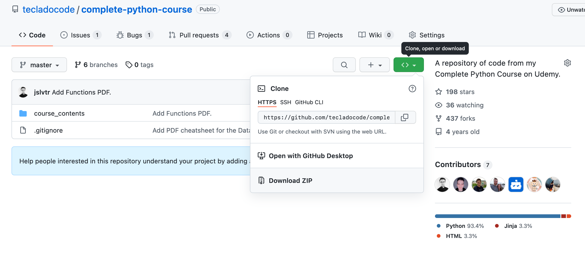

# Complete Python Course | Learn Python by Doing in 2022

 </a>

    

---

💡 A 35-hour mega course to take you from beginner to advanced in Python.

## Getting started

Enrol in the course by going to [this link](https://go.tecla.do/cpc).

Then come back here and download the entire repository. If you are familiar with Git, you can use Git to download it. Otherwise, you can download it as a zip file:

Next, start taking the course at the beginning! You can use the downloaded code files to support you while you go through the course.

I also **strongly recommend** you code while you take the course. A good strategy is:

1. Watch the video intently, optionally while taking notes.
2. Watch again, more quickly, while typing the code together with me.
3. Once you're done with the video, play about with the code. Make changes, break things, then fix them, and try to thoroughly understand everything the code does.

If you do this for the entire course, I guarantee you will learn Python well. You'll still be using Google and searching for stuff every day, but so does everyone else!

## Topics

We cover many contents in the [video-course](https://go.tecla.do/cpc), but this repo has (almost) all the code we write, per lecture. Where relevant, there is also code for projects taught in the course.

- [Python Intro](course_contents/1_intro)
  - Variables, numbers
  - String formatting
  - User input
  - Booleans
  - Lists, tuples, sets
  - Dictionaries
- [Python fundamentals](course_contents/2_intro_to_python)
  - If statements
  - Loops
  - Destructuring
  - Iteration
  - `Break` and `continue`
  - Slicing
  - List, set, and dictionary comprehensions
  - `zip` and `enumerate`
  - Functions
  - Arguments, parameters, and return values
  - Default parameter values
  - Lambda functions
- [Object-Oriented Programming](course_contents/4_object_oriented_programming)
- [Python errors](course_contents/5_errors)
- [Working with files](course_contents/6_files)
- [Type hinting](course_contents/8_type_hinting/)
- [Advanced Python Development](course_contents/10_advanced_python)
- [Web Scraping](course_contents/11_web_scraping)
- [Browser Automation with Selenium](course_contents/12_browser_automation_selenium)
- [Async Development with Python](course_contents/13_async_development)
- [Managing Projects with Pipenv](course_contents/14_managing_projects_pipenv)
- [Flask and Web Development](course_contents/15_flask)
- [Interacting with APIs using Python](course_contents/16_interacting_with_apis)
- [Decorators](course_contents/17_decorators/)
  - [DecoratorsYouTube mini-course](https://blog.teclado.com/decorators-in-python/)
- [Advanced OOP](course_contents/18_advanced_oop)
- [GUI Development with Tkinter](course_contents/19_gui_development_tkinter)
- [Unit testing](course_contents/20_unit_testing)
- [Algorithms and Data Structures](course_contents/21_algorithms_data_structures)
- [Useful Python libraries](course_contents/22_popular_libraries)